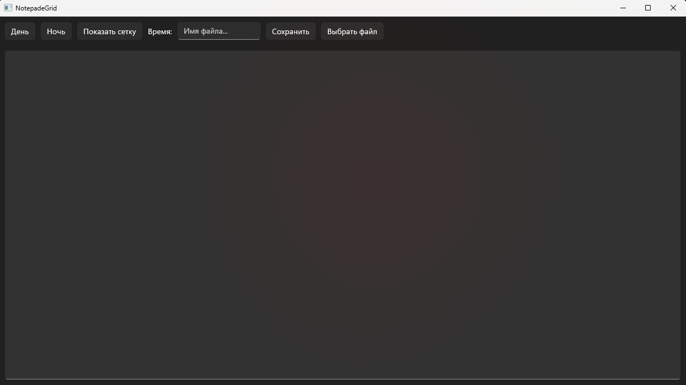

# NotepadeGrid
*Мой блокнот/заметки первое UI программа на C#*
## Функционал
-  Создание и сохранение заметок
-  Дневная/ночная тема
-  Фоновая сетка как в тетради
-  Открытие и сохранение .txt файлов

## Скриншот

